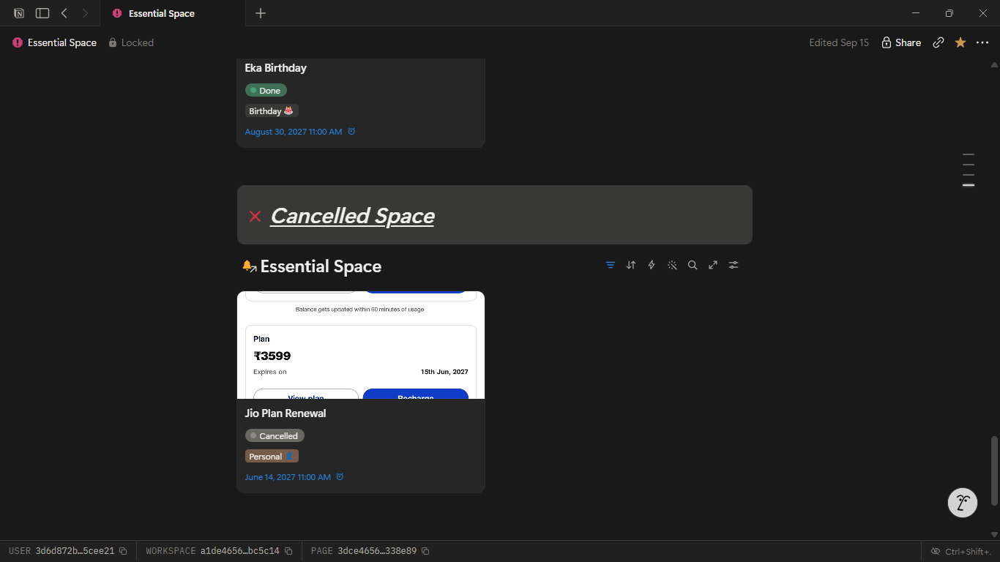
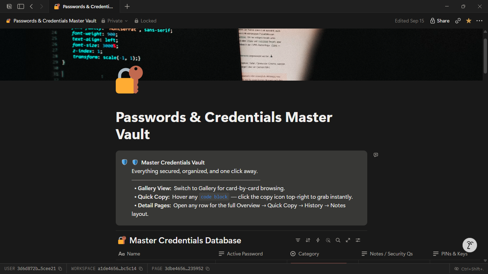
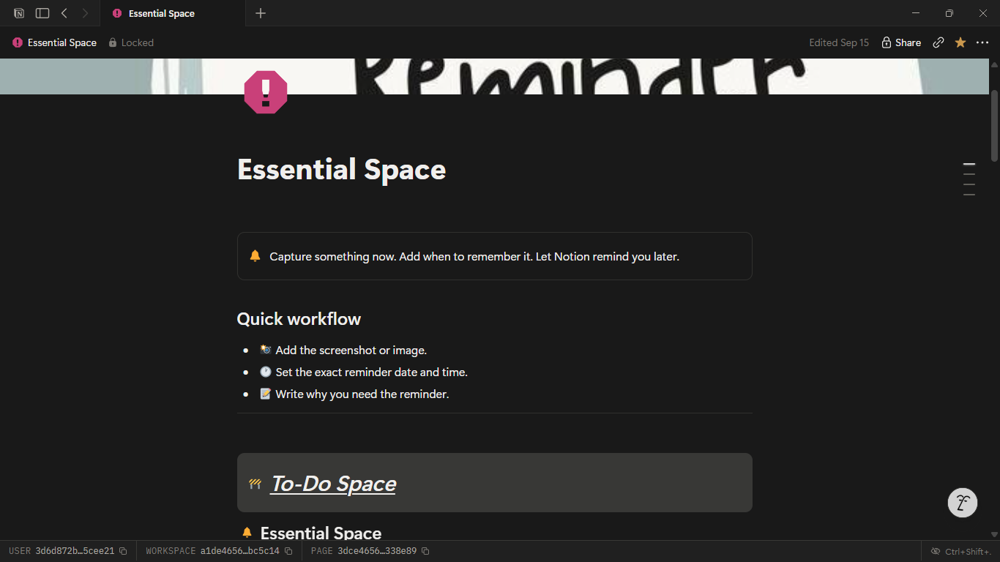
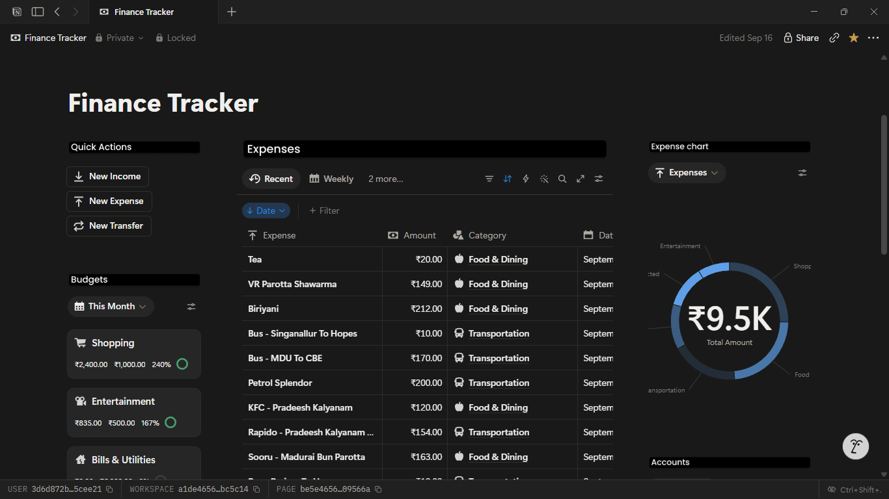
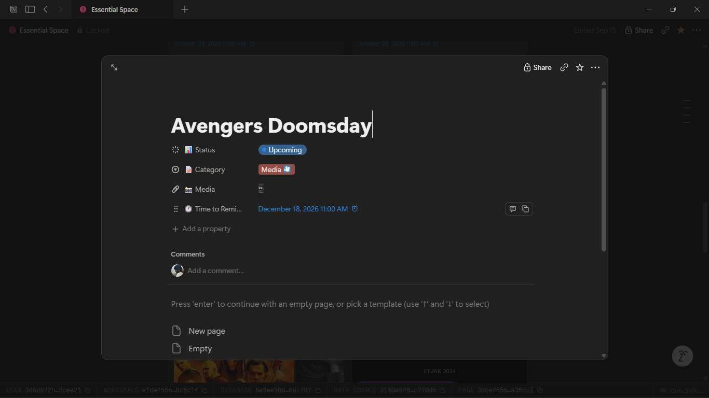
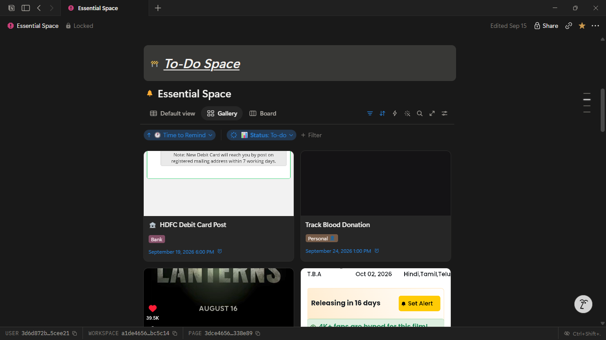

# Notion Projects

A collection of Python scripts that connect to the [Notion API](https://developers.notion.com/) to extract, back up, and update content across different Notion workspaces — Notes, Reminders, Travel Planner, and a shared Document Database.

Each module follows the same pattern:
- **Get Page.py** — reads a Notion page (and its sub-pages/blocks), exports the content to a local JSON file.
- **Update Page.py** — reads the local JSON file and pushes updates back to the Notion page.

---

## What this repo can do

- Extract full page content (including nested/child pages) from Notion into structured JSON
- Keep a local, version-controlled backup of your Notion pages
- Programmatically update Notion pages from a JSON source of truth
- Automate recurring tasks — reminders, travel itinerary updates, note syncing — without touching the Notion UI


---

## Repository Structure

```
.
├── Doc Database for Notion.py       # Shared/central document database utilities
├── notion_automation.py             # Core automation entry point / shared helpers
│
├── photos/                          # Screenshots used in this README
│   ├── architecture-overview.png
│   ├── create-integration.png
│   ├── share-page.png
│   └── get-update-workflow.png
│
├── Notes/
│   ├── Create Search Database.py    # Creates a searchable Notion database for notes
│   ├── Get Page.py                  # Extracts Notes page content → JSON
│   └── Update Page.py               # Pushes JSON updates back to the Notes page
│
├── Reminder/
│   ├── Get Page.py                  # Extracts Reminder page content → JSON
│   ├── Update Page.py               # Pushes JSON updates back to the Reminder page
│   ├── notion_reminder_setup.py     # One-time setup for the reminder system
│   ├── notion_reminder_system_ids.json  # Stored page/database IDs for reminders
│   └── reminder.json                # Exported reminder content
│
└── Travel Planner/
    ├── Get Page.py                  # Extracts Travel Planner page content → JSON
    ├── Update Page.py               # Pushes JSON updates back to the Travel Planner page
    └── travel_planner.json          # Exported travel planner content
```

---

## Prerequisites

- Python 3.9+
- A Notion account
- A Notion **integration token**

---

## Setting up Notion for this project

### 1. Create a Notion Integration

1. Go to [notion.so/my-integrations](https://www.notion.so/my-integrations)
2. Click **New integration**
3. Give it a name (e.g. `notion-projects-automation`), select your workspace
4. Set the required capabilities: **Read content**, **Update content**, **Insert content**
5. Click **Submit** and copy the generated **Internal Integration Token** (starts with `secret_` or `ntn_`)


### 2. Share your pages with the integration

Notion integrations can only see pages you explicitly share with them.

1. Open the page you want this repo to manage (Notes, Reminder, Travel Planner, Doc Database)
2. Click the **`•••`** menu (top right) → **Connections** → search for your integration name → **Connect**
3. Repeat for every page/database this repo needs access to

<!-- IMAGE: screenshot of sharing a page with the integration -->



















### 3. Get each Page/Database ID

1. Open the page in your browser
2. Copy the 32-character ID from the URL:
   `https://www.notion.so/My-Page-<PAGE_ID>`
3. Store these IDs in your `.env` file or the relevant `*_ids.json` file (see `notion_reminder_system_ids.json` for an example pattern)

### 4. Configure environment variables

Create a `.json` file in the repo root:

```json
{"NOTION_TOKEN": "secret_xxxxxxxxxxxxxxxxxxxxxxxxxxxx"}
```

> **Never commit `.env` to version control.** Make sure it's listed in `.gitignore`.

### 5. Install dependencies

```bash
pip install notion-client python-dotenv
```

---

## Usage

### Extract a page to JSON

```bash
cd "Reminder"
python "Get Page.py"
```

This reads the target page from Notion (including child pages/blocks) and writes the content to the module's `.json` file (e.g. `reminder.json`).

### Update a page from JSON

Edit the exported `.json` file with your changes, then run:

```bash
python "Update Page.py"
```

This reads the JSON and pushes the changes back to the corresponding Notion page.


Repeat the same `Get Page.py` → edit JSON → `Update Page.py` flow for each module (`Notes/`, `Reminder/`, `Travel Planner/`).

---

## Module Notes

| Module | Purpose |
|---|---|
| `Notes/` | Syncs and searches personal notes; `Create Search Database.py` sets up a queryable Notion database for notes |
| `Reminder/` | Manages a reminder system; `notion_reminder_setup.py` provisions the reminder database/page once, `notion_reminder_system_ids.json` caches its IDs |
| `Travel Planner/` | Extracts/updates a travel itinerary page |
| `Doc Database for Notion.py` | Shared document database logic used across modules |
| `notion_automation.py` | Common automation helpers (Notion client setup, shared functions) |

---

## Roadmap / Ideas

- [ ] Consolidate shared Notion client/auth logic into a single `common/` module
- [ ] Add scheduled runs (cron / GitHub Actions) for automatic sync
- [ ] Add error handling + retry logic for Notion API rate limits

